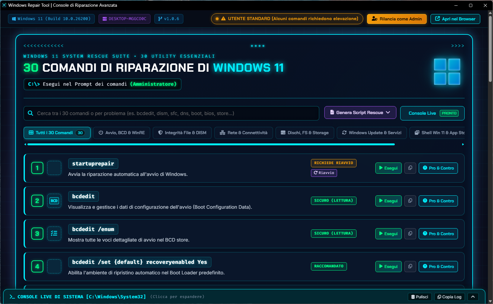
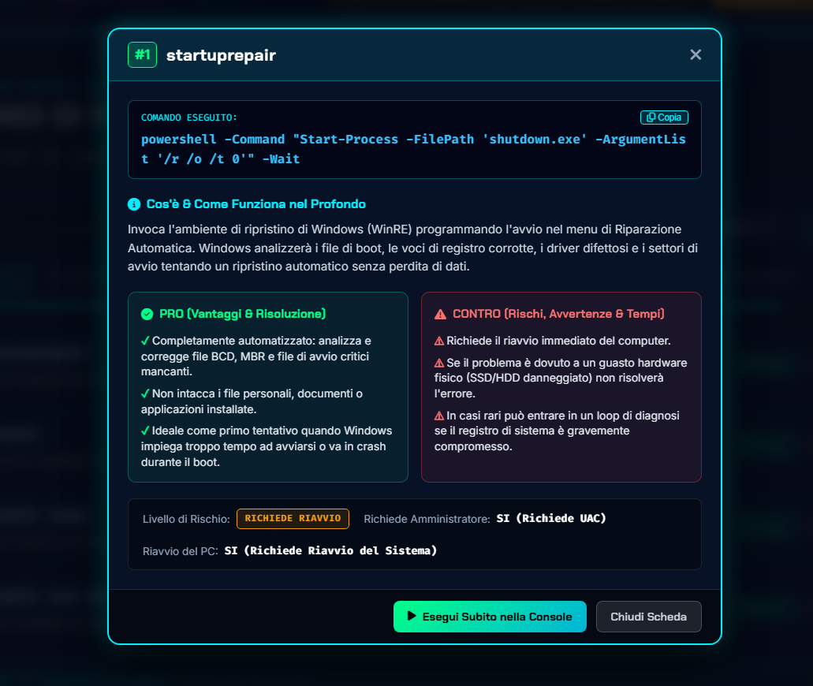

<div align="center">

# 🛠️ Windows Repair Tool
### Console di Riparazione Avanzata & Coltellino di Sistema per Windows 10 e 11

[](https://github.com/AngoloInformatico)
[](https://github.com/AngoloInformatico)
[](https://www.python.org/)
[](https://github.com/AngoloInformatico)
[](LICENSE)

<br/>

[](https://www.youtube.com/@AngoloInformatico)
[](https://github.com/AngoloInformatico)
[](https://github.com/AngoloInformatico?tab=repositories)

<p align="center">
  <b>Una suite completa di manutenzione, diagnostica e ripristino profondo per Windows 11 e Windows 10.</b><br/>
  Interfaccia ad alto impatto Cyberpunk HUD, esecuzione comandi in tempo reale con streaming console live,<br/>
  analisi tecnica con <b>PRO & CONTRO</b> dettagliati per ogni operazione ed elevazione privilegi UAC integrata.
</p>

</div>

---

## 📋 Indice dei Contenuti
- [📸 Screenshot & Anteprima Interfaccia](#-screenshot--anteprima-interfaccia)
- [Caratteristiche Principali](#-caratteristiche-principali)
- [Catalogo dei 30 Comandi di Riparazione](#-catalogo-dei-30-comandi-di-riparazione)
- [Architettura del Progetto](#-architettura-del-progetto)
- [Requisiti di Sistema](#-requisiti-di-sistema)
- [Installazione & Avvio Rapido](#-installazione--avvio-rapido)
- [Come Funziona la Finestra Applicazione](#-come-funziona-la-finestra-applicazione)
- [Chiusura Sincronizzata dei Processi](#-chiusura-sincronizzata-dei-processi)
- [Licenza (GNU GPLv3)](#-licenza)
- [Crediti & Canali Ufficiali](#-crediti--canali-ufficiali)

---

## 📸 Screenshot & Anteprima Interfaccia

<div align="center">

### 🖥️ Dashboard Principale - Console Cyberpunk HUD & Suite 30 Comandi


<br/>

### 🔬 Scheda Analisi Tecnica Dettagliata (PRO & CONTRO) e Console Terminale Live


</div>

---

## ⚡ Caratteristiche Principali

- **🖥️ Finestra Applicazione Dedicata Standalone:** Si apre direttamente in una finestra nativa priva di barre, schede o URL del browser, posizionata automaticamente e con precisione al centro dello schermo su qualsiasi risoluzione.
- **⚡ Chiusura Sincronizzata Istantanea:** Alla chiusura della finestra con la classica "X", un sistema combinato di `beforeunload` beacon e watchdog heartbeat a 2 secondi arresta istantaneamente il server locale Flask e tutti i processi correlati.
- **🛡️ 30 Comandi di Riparazione Curati:** Include i comandi essenziali e avanzati per riparare boot BCD, integrità file di sistema DISM/SFC, stack di rete TCP/IP, hard disk/SSD, Windows Update e shell Explorer.
- **🔬 Analisi Tecnica PRO & CONTRO:** Ogni singolo comando dispone di una scheda informativa approfondita che spiega esattamente cosa fa, i benefici (PRO), i rischi e controindicazioni (CONTRO) e il livello di sicurezza operativo.
- **📟 Console Terminale Live (Espandibile / Riducibile):** Streaming dei log in tempo reale tramite Server-Sent Events (SSE). La console può essere ridotta a icona e riaperta in qualsiasi momento cliccando sull'header o sul pulsante chevron.
- **👑 Elevazione Privilegi UAC in 1-Click:** Riconoscimento automatico dei privilegi di amministratore con indicatore visivo verde/ambra e pulsante rapido di rilancio con richiesta UAC.
- **📦 Esportazione Script (.ps1 & .bat):** Possibilità di esportare l'intero set di 30 comandi con un solo clic in script PowerShell o file Batch pronti all'uso per interventi di manutenzione offline.
- **🔄 Auto-Incremento Versione:** Sistema di calcolo hash MD5 (`version_manager.py`) che aggiorna automaticamente il numero di build a ogni salvataggio dei sorgenti.

---

## 🛠️ Catalogo dei 30 Comandi di Riparazione

| # | Comando | Categoria | Livello Rischio | Descrizione Rapida |
|---|---|---|---|---|
| **01** | `startuprepair` | Avvio / WinRE | Richiede Riavvio | Invia al menu di riparazione automatica all'avvio |
| **02** | `bcdedit` | Avvio / BCD | Sicuro | Visualizza la configurazione del Boot Loader |
| **03** | `bcdedit /enum {badmemory}` | Avvio / RAM | Sicuro | Elenca i blocchi di memoria RAM marcati difettosi |
| **04** | `bcdedit /set recoveryenabled Yes` | Avvio / WinRE | Raccomandato | Abilita l'ambiente di ripristino automatico di Windows |
| **05** | `sfc /scannow` | Integrità File | Sicuro | Scansione e ripristino file di sistema corrotti |
| **06** | `DISM /CheckHealth` | Integrità DISM | Sicuro | Verifica rapida dello stato di corruzione immagine |
| **07** | `DISM /ScanHealth` | Integrità DISM | Sicuro | Scansione avanzata dei componenti dell'immagine Windows |
| **08** | `DISM /RestoreHealth` | Integrità DISM | Fondamentale | Ripara l'archivio componenti Windows tramite Windows Update |
| **09** | `Dism /StartComponentCleanup` | Manutenzione | Sicuro | Pulisce l'archivio WinSxS e rimuove backup obsoleti |
| **10** | `shutdown /r /fw /t 0` | Avvio / UEFI | Richiede Riavvio | Riavvia il PC entrando direttamente nel BIOS/UEFI |
| **11** | `ipconfig /flushdns` | Rete & DNS | Sicuro | Svuota e reimposta la cache del resolver DNS locale |
| **12** | `netsh winsock reset` | Rete | Richiede Riavvio | Ripristina il catalogo Winsock ai valori predefiniti |
| **13** | `netsh int ip reset` | Rete | Richiede Riavvio | Reimposta completamente lo stack TCP/IP di Windows |
| **14** | `chkdsk C: /scan` | Dischi / FS | Sicuro | Scansione online dell'integrità del filesystem NTFS |
| **15** | `defrag C: /O` | Dischi / Storage | Sicuro | Ottimizza e invia TRIM all'SSD o deframmenta HDD |
| **16** | `cleanmgr /sageset & sagerun` | Pulizia Disco | Sicuro | Pulizia disco avanzata dei file temporanei di sistema |
| **17** | `Reset-WindowsUpdate` | Windows Update | Riparazione | Riavvia i servizi e svuota la cache SoftwareDistribution |
| **18** | `taskkill /f /im explorer.exe` | Shell Win 11 | Sicuro | Riavvia il processo della barra applicazioni e Start |
| **19** | `wsreset.exe` | Microsoft Store | Sicuro | Ripristina e svuota la cache del Microsoft Store |
| **20** | `Get-AppxPackage (Re-Register)` | App UWP / Shell | Riparazione App | Ripristina e registra nuovamente le app native di Windows 11 |
| **21** | `DISM /AnalyzeComponentStore` | WinSxS | Sicuro | Analizza le dimensioni e consiglia la pulizia di WinSxS |
| **22** | `powercfg /energy` | Diagnostica | Sicuro | Genera report HTML dettagliato sull'efficienza energetica |
| **23** | `powercfg /batteryreport` | Diagnostica | Sicuro | Analizza usura, cicli e salute della batteria del laptop |
| **24** | `mdsched.exe` | Hardware / RAM | Richiede Riavvio | Avvia lo strumento Diagnostica memoria Windows |
| **25** | `perfmon /report` | Diagnostica | Sicuro | Crea un profilo diagnostico completo di CPU, RAM e dischi |
| **26** | `winmgmt /verifyrepository` | WMI / Servizi | Sicuro | Verifica l'integrità del repository Windows Management |
| **27** | `secedit /configure /deflt.inf` | Sicurezza | Con Cautela | Ripristina i modelli di sicurezza e permessi predefiniti |
| **28** | `vssadmin list shadows` | Ripristino | Sicuro | Elenca le copie shadow e punti di ripristino attivi |
| **29** | `fltmc` | Kernel / Driver | Sicuro | Visualizza i driver di filtro del filesystem attivi |
| **30** | `verifier` | Driver / BSOD | Richiede Riavvio | Gestione Driver Verifier per individuare driver in crash |

---

## 📂 Architettura del Progetto

```
Windows Repair/
├── app.py                     # Server Flask, controller API, SSE streaming e window launcher
├── commands_data.py           # Database tecnico dei 30 comandi con PRO e CONTRO
├── version_manager.py         # Calcolo automatico hash MD5 e build incrementale
├── version.json               # Persistenza della versione software attiva
├── start.bat                  # Script di lancio rapido con controllo amministratore
├── requirements.txt           # Dipendenze Python necessarie
├── LICENSE                    # Licenza GNU General Public License Version 3 (GPLv3)
├── .gitignore                 # Esclusioni per Git e GitHub
├── README.md                  # Documentazione ufficiale del repository
├── templates/
│   └── index.html             # Markup dell'interfaccia HUD Cyberpunk
└── static/
    ├── css/
    │   └── style.css          # Foglio di stile Cyberpunk HUD, animazioni e layout fluido
    └── js/
        └── app.js             # Logica interattiva client, terminale, SSE e heartbeat
```

---

## 💻 Requisiti di Sistema

- **Sistema Operativo:** Windows 11 / Windows 10 (64-bit consigliato)
- **Python:** Versione 3.10, 3.11, 3.12, 3.13 o 3.14+
- **Browser di supporto:** Microsoft Edge (incluso di default su Windows 11/10) o Google Chrome per la modalità standalone.
- **Privilegi:** Si consiglia di eseguire come **Amministratore** per consentire l'esecuzione dei comandi di basso livello (`SFC`, `DISM`, `BCDEDIT`, `CHKDSK`).

---

## 🚀 Installazione & Avvio Rapido

### 1. Clona il repository
```bash
git clone https://github.com/AngoloInformatico/Windows-Repair-Tool.git
cd "Windows-Repair-Tool"
```

### 2. Installa le dipendenze
```bash
pip install -r requirements.txt
```

### 3. Avvio dell'Applicazione
Puoi avviare l'applicazione in due modi:

- **Metodo 1 (Consigliato):** Fai tasto destro su [`start.bat`](start.bat) e seleziona **"Esegui come amministratore"**.
- **Metodo 2 (Da terminale):**
  ```bash
  python app.py
  ```
- **Metodo 3 (Compilazione Eseguibile .exe Standalone):**
  Per generare l'eseguibile nativo Windows con icona incorporata e senza console terminale:
  ```bash
  python GeneraExe.py
  ```
  L'eseguibile pronto all'uso verrà creato nella cartella `dist/Windows Repair Tool/Windows Repair Tool.exe`. Ad ogni esecuzione, lo script pulisce completamente `dist` e rigenera tutto da zero.

---

## 🪟 Come Funziona la Finestra Applicazione

All'avvio, il programma:
1. Inizializza il server locale su `http://127.0.0.1:5000` (se la porta 5000 è occupata da un altro programma, seleziona ed assegna automaticamente in tempo reale la prima porta libera successiva: 5001, 5002, ecc.).
2. Calcola le coordinate geometriche precise per centrare la finestra sullo schermo principale tramite le API Win32 `user32.GetSystemMetrics`.
3. Lancia direttamente l'interfaccia in **modalità applicazione nativa** (`msedge.exe --app=... --window-position=X,Y --window-size=1560,960`).
4. Nessuna barra degli indirizzi o scheda del browser viene mostrata: la WebApp si presenta come un vero software desktop indipendente.
5. In alto a destra è disponibile il pulsante **"Apri nel Browser"** nel caso si desideri aprire la sessione nel browser predefinito a schede complete.

---

## 🛑 Chiusura Sincronizzata dei Processi

Non occorre chiudere manualmente finestre di terminale:
- Quando l'utente preme il pulsante **X** della finestra applicazione, il browser invia istantaneamente un segnale tramite `navigator.sendBeacon('/api/shutdown')`.
- In aggiunta, un thread di monitoraggio *Watchdog* verifica la presenza di un battito cardiaco (*heartbeat*) ogni 1.5 secondi: in assenza di segnale per oltre 5 secondi, tutti i processi Python e Flask vengono arrestati automaticamente e puliti dalla memoria.

---

## 📄 Licenza

Questo progetto è rilasciato sotto licenza **GNU GENERAL PUBLIC LICENSE Version 3 (GPLv3)**.  
Consulta il file completo [LICENSE](LICENSE) per i termini dettagliati di distribuzione, modifica e libertà del software.

```
Copyright (C) 2026 Alex Lignola - Windows Repair Tool
Questo programma è software libero: puoi ridistribuirlo e/o modificarlo
sotto i termini della GNU General Public License versione 3.
```

---

## 🌟 Crediti & Canali Ufficiali

Sviluppato con passione da **Alex Lignola**.

- 📺 **YouTube:** [@AngoloInformatico](https://www.youtube.com/@AngoloInformatico)
- 🐙 **GitHub Profilo:** [AngoloInformatico](https://github.com/AngoloInformatico)
- 📁 **Repository & Progetti:** [Tutti i Repository](https://github.com/AngoloInformatico?tab=repositories)

---
<div align="center">
  <sub>Windows Repair Tool • © 2026 Alex Lignola • All rights reserved.</sub>
</div>
